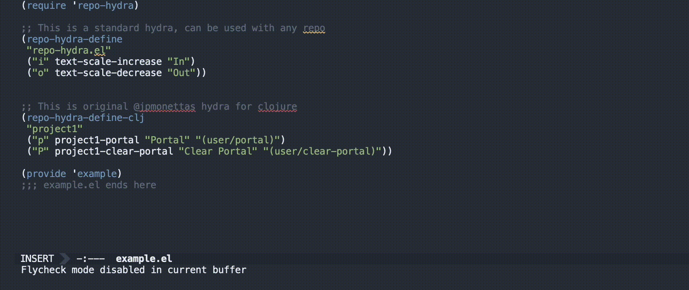

# repo-hydra.el
Easily create repo-specific menus for Emacs.

This library was inspired by an amazingly instructive [interview](https://www.youtube.com/watch?v=2nH59edD5Uo) by Juan Monetta ([@jpmonettas](https://github.com/jpmonettas)), he also wrote the main macro which I only slightly improved and turned into a library.

## Examples
### Normal repo hydra
This is an example repo-hydra for this repository. 
```elisp
(repo-hydra-define
 "repo-hydra.el"
 ("i" text-scale-increase "In")
 ("o" text-scale-decrease "Out"))
 ```
 
 
 If `repo-hydra-show` is called from within the `repo-hydra.el` repository, the hydra will show:
   

### Clojure repo hydra
I have kept the original logic of the Clojure macro in `repo-hydra-define-clj`, it automatically evaluates the clojure code in strings with the current CIDER REPL:

```elisp
(repo-hydra-define-clj
 "sanskrit"
 ("c" sanskrit-cider-connect "Connect REPL" (cider-connect-clj '(:host "localhost" :port 33000)))
 ("p" sanskrit-portal "Portal" "(user/portal)")
 ("P" sanskrit-clear-portal "Clear Portal" "(user/clear-portal)")
 ("S" sanskrit-require-snitch "Require snitch" "(require '[snitch.core :refer [defn* defmethod* *fn *let]])"))
```

## Install

### Using use-package and straight
```elisp
(use-package repo-hydra
  :straight (:type git :host github :repo "licht1stein/repo-hydra.el" :tag "v.1.0.0")
  :bind ("<f6>" . repo-hydra-show))
```


## Versioning
This library uses [break versioning](https://github.com/ptaoussanis/encore/blob/master/BREAK-VERSIONING.md), this means that upgrading from 1.0.x to 1.0.whatever is always non-breaking, upgrading to 1.1.x might break something small, and upgrading to 2.x.x will break something big.
